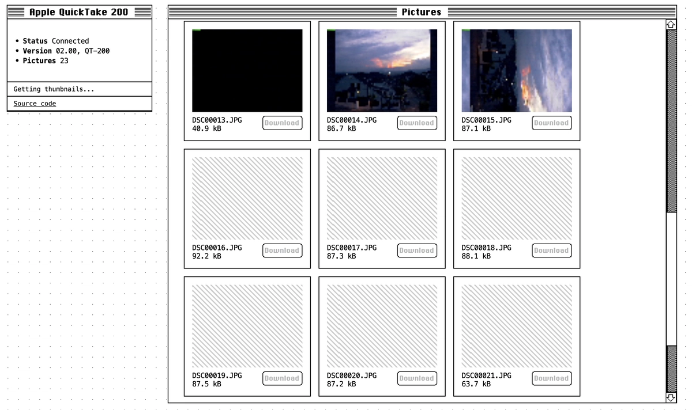

# Apple QuickTake 200 Client

An experimental browser client for the Apple QuickTake 200 camera, built using the [Web Serial API](https://developer.mozilla.org/en-US/docs/Web/API/Web_Serial_API)

Read the full write-up: [Reverse Engineering the Apple QuickTake 200 in 2026](https://medvedev.im/articles/2026-06-07/quicktake-200)

